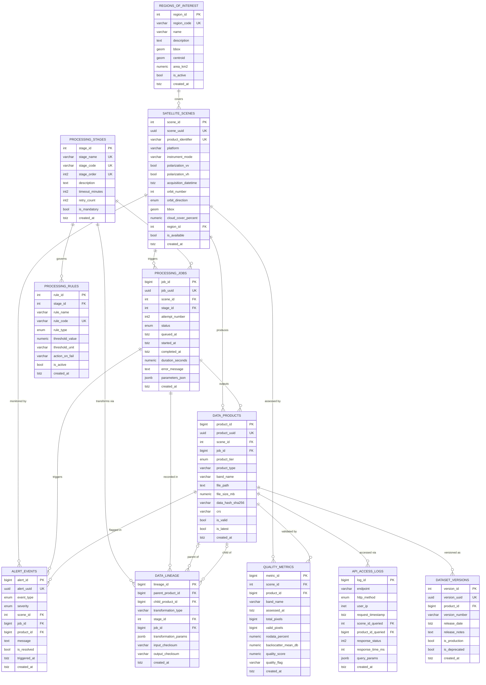

# DATABASE DESIGN DOCUMENTATION
## Sentinel-1 Flood Detection Data Pipeline
**Author:** Julius Marselinus (BRONTO) — NIM 00000111989  
**Program:** Sistem Informasi — Universitas Multimedia Nusantara  
**Version:** 1.0.0 | **Date:** 2026-06-29

---

## 1. ENTITY-RELATIONSHIP DIAGRAM (Mermaid ERD)



---

## 2. DATA DICTIONARY

### Table 1: `regions_of_interest`
| Column | Data Type | Constraint | Purpose |
|--------|-----------|------------|---------|
| region_id | SERIAL | PK, NOT NULL | Surrogate primary key |
| region_code | VARCHAR(20) | UNIQUE, NOT NULL | Short identifier (e.g. 'JKT', 'JABODTK') |
| name | VARCHAR(100) | NOT NULL | Full region name |
| description | TEXT | NULLABLE | Narrative description of the AOI |
| bbox | GEOMETRY(POLYGON,4326) | NOT NULL | WGS84 bounding polygon (PostGIS) |
| centroid | GEOMETRY(POINT,4326) | AUTO | Auto-computed centroid via trigger |
| area_km2 | NUMERIC(12,4) | NULLABLE | Surface area in km² |
| admin_level | SMALLINT | NOT NULL, DEFAULT 2 | 1=national, 2=province, 3=city |
| country_code | CHAR(2) | NOT NULL, DEFAULT 'ID' | ISO 3166-1 alpha-2 |
| is_active | BOOLEAN | NOT NULL, DEFAULT TRUE | Soft-delete flag |
| created_at | TIMESTAMPTZ | NOT NULL | Record creation timestamp |
| updated_at | TIMESTAMPTZ | NOT NULL, AUTO | Last modification timestamp |

### Table 2: `processing_stages`
| Column | Data Type | Constraint | Purpose |
|--------|-----------|------------|---------|
| stage_id | SERIAL | PK, NOT NULL | Surrogate primary key |
| stage_name | VARCHAR(50) | UNIQUE, NOT NULL | Full stage name (e.g. 'DOWNLOAD') |
| stage_code | VARCHAR(20) | UNIQUE, NOT NULL | Short code (e.g. 'DL') |
| stage_order | SMALLINT | UNIQUE, NOT NULL | Execution sequence (1–6) |
| description | TEXT | NULLABLE | Stage purpose description |
| timeout_minutes | SMALLINT | NOT NULL, DEFAULT 60 | Maximum allowed execution time |
| retry_count | SMALLINT | NOT NULL, DEFAULT 3 | Max retry attempts on failure |
| retry_delay_sec | SMALLINT | NOT NULL, DEFAULT 30 | Wait between retries (seconds) |
| is_mandatory | BOOLEAN | NOT NULL, DEFAULT TRUE | Whether stage can be skipped |
| is_active | BOOLEAN | NOT NULL, DEFAULT TRUE | Soft-delete / disable stage |
| created_at | TIMESTAMPTZ | NOT NULL | Record creation timestamp |
| updated_at | TIMESTAMPTZ | NOT NULL, AUTO | Last modification timestamp |

### Table 3: `satellite_scenes`
| Column | Data Type | Constraint | Purpose |
|--------|-----------|------------|---------|
| scene_id | SERIAL | PK, NOT NULL | Surrogate primary key |
| scene_uuid | UUID | UNIQUE, NOT NULL | External-safe identifier |
| product_identifier | VARCHAR(200) | UNIQUE, NOT NULL | ESA Copernicus Hub product ID |
| platform | VARCHAR(20) | NOT NULL, DEFAULT 'SENTINEL-1' | Satellite platform name |
| instrument_mode | VARCHAR(10) | NOT NULL, DEFAULT 'IW' | IW/EW/SM/WV acquisition mode |
| polarization_vv | BOOLEAN | NOT NULL, DEFAULT TRUE | VV band availability flag |
| polarization_vh | BOOLEAN | NOT NULL, DEFAULT TRUE | VH band availability flag |
| acquisition_datetime | TIMESTAMPTZ | NOT NULL | UTC SAR acquisition timestamp |
| orbit_number | INTEGER | NULLABLE | Absolute orbit number |
| orbit_direction | ENUM | NOT NULL | ASCENDING or DESCENDING orbit pass |
| relative_orbit | SMALLINT | NULLABLE | Relative orbit number (1–175) |
| bbox | GEOMETRY(POLYGON,4326) | NOT NULL | Scene footprint polygon (PostGIS) |
| cloud_cover_percent | NUMERIC(5,2) | CHECK 0–100 | Optical cloud coverage estimate |
| incidence_angle_near | NUMERIC(6,3) | NULLABLE | Near-range incidence angle (°) |
| incidence_angle_far | NUMERIC(6,3) | NULLABLE | Far-range incidence angle (°) |
| resolution_m | SMALLINT | NOT NULL, DEFAULT 10 | Ground resolution in meters |
| region_id | INTEGER | FK→ROI, NOT NULL | Associated area of interest |
| raw_file_path | TEXT | NULLABLE | Local path to downloaded file |
| raw_file_size_mb | NUMERIC(12,3) | NULLABLE | Raw download file size |
| download_url | TEXT | NULLABLE | Source URL for re-download |
| checksum_md5 | VARCHAR(32) | NULLABLE | MD5 integrity check of raw file |
| is_available | BOOLEAN | NOT NULL, DEFAULT TRUE | Data availability flag |
| created_at | TIMESTAMPTZ | NOT NULL | Record creation timestamp |
| updated_at | TIMESTAMPTZ | NOT NULL, AUTO | Last modification timestamp |

### Table 4: `processing_jobs`
| Column | Data Type | Constraint | Purpose |
|--------|-----------|------------|---------|
| job_id | BIGSERIAL | PK, NOT NULL | Surrogate primary key |
| job_uuid | UUID | UNIQUE, NOT NULL | External-safe job identifier |
| scene_id | INTEGER | FK→Scenes, NOT NULL | Scene being processed |
| stage_id | INTEGER | FK→Stages, NOT NULL | Pipeline stage of this job |
| attempt_number | SMALLINT | NOT NULL, DEFAULT 1 | Retry attempt counter |
| status | ENUM | NOT NULL, DEFAULT 'QUEUED' | QUEUED/RUNNING/SUCCESS/FAILED/CANCELLED |
| queued_at | TIMESTAMPTZ | NOT NULL | When job entered the queue |
| started_at | TIMESTAMPTZ | NULLABLE | When execution began |
| completed_at | TIMESTAMPTZ | NULLABLE | When execution ended |
| duration_seconds | NUMERIC(10,3) | GENERATED | Auto-computed from timestamps |
| worker_hostname | VARCHAR(100) | NULLABLE | Executing machine hostname |
| cpu_usage_percent | NUMERIC(5,2) | NULLABLE | CPU utilization during job |
| memory_usage_mb | NUMERIC(10,2) | NULLABLE | RAM usage during job |
| input_size_mb | NUMERIC(12,3) | NULLABLE | Input file size |
| output_size_mb | NUMERIC(12,3) | NULLABLE | Output file size |
| error_code | VARCHAR(50) | NULLABLE | Structured error code |
| error_message | TEXT | NULLABLE | Full error traceback |
| log_file_path | TEXT | NULLABLE | Path to execution log file |
| parameters_json | JSONB | NOT NULL, DEFAULT '{}' | ETL parameters used |
| created_at | TIMESTAMPTZ | NOT NULL | Record creation timestamp |
| updated_at | TIMESTAMPTZ | NOT NULL, AUTO | Last modification timestamp |

### Table 5: `data_products`
| Column | Data Type | Constraint | Purpose |
|--------|-----------|------------|---------|
| product_id | BIGSERIAL | PK, NOT NULL | Surrogate primary key |
| product_uuid | UUID | UNIQUE, NOT NULL | External-safe product identifier |
| scene_id | INTEGER | FK→Scenes, NOT NULL | Parent scene |
| job_id | BIGINT | FK→Jobs, NOT NULL | Producing ETL job |
| product_tier | ENUM | NOT NULL | RAW / BRONZE / SILVER / GOLD |
| product_type | VARCHAR(50) | NOT NULL | CROPPED_TIFF, LEE_FILTERED, COG, etc. |
| band_name | VARCHAR(10) | NOT NULL | VV, VH, or VV_VH |
| file_name | VARCHAR(255) | NOT NULL | Output filename |
| file_path | TEXT | NOT NULL | Full storage path |
| file_size_mb | NUMERIC(12,3) | NOT NULL | File size in MB |
| file_format | VARCHAR(20) | NOT NULL, DEFAULT 'TIFF' | TIFF / COG / NetCDF |
| data_hash_sha256 | VARCHAR(64) | NOT NULL | SHA-256 content hash |
| crs | VARCHAR(50) | NOT NULL, DEFAULT 'EPSG:4326' | Coordinate reference system |
| pixel_size_m | NUMERIC(8,3) | NULLABLE | Pixel ground sampling distance |
| nodata_value | NUMERIC | NULLABLE | NoData sentinel value |
| rows | INTEGER | NULLABLE | Raster row count |
| cols | INTEGER | NULLABLE | Raster column count |
| band_count | SMALLINT | NOT NULL, DEFAULT 1 | Number of raster bands |
| storage_location | ENUM | NOT NULL, DEFAULT 'LOCAL' | LOCAL/S3/GCS/AZURE_BLOB |
| is_valid | BOOLEAN | NOT NULL, DEFAULT TRUE | Integrity check passed |
| is_latest | BOOLEAN | NOT NULL, DEFAULT TRUE | Latest version flag |
| created_at | TIMESTAMPTZ | NOT NULL | Record creation timestamp |
| updated_at | TIMESTAMPTZ | NOT NULL, AUTO | Last modification timestamp |

### Table 6: `quality_metrics`
| Column | Data Type | Constraint | Purpose |
|--------|-----------|------------|---------|
| metric_id | BIGSERIAL | PK, NOT NULL | Surrogate primary key |
| scene_id | INTEGER | FK→Scenes, NOT NULL | Associated scene |
| product_id | BIGINT | FK→Products, NOT NULL | Assessed product |
| band_name | VARCHAR(10) | NOT NULL | Band assessed (VV or VH) |
| assessed_at | TIMESTAMPTZ | NOT NULL | Quality assessment timestamp |
| total_pixels | BIGINT | NOT NULL | Total pixel count in raster |
| valid_pixels | BIGINT | NOT NULL | Non-nodata pixel count |
| nodata_pixels | BIGINT | NOT NULL, DEFAULT 0 | NoData pixel count |
| nodata_percent | NUMERIC(5,2) | GENERATED | Auto: nodata_pixels/total×100 |
| backscatter_mean_db | NUMERIC(8,4) | NULLABLE | Mean backscatter value (dB) |
| backscatter_std_db | NUMERIC(8,4) | NULLABLE | Std dev of backscatter (dB) |
| backscatter_min_db | NUMERIC(8,4) | NULLABLE | Minimum backscatter (dB) |
| backscatter_max_db | NUMERIC(8,4) | NULLABLE | Maximum backscatter (dB) |
| cloud_threshold_percent | NUMERIC(5,2) | NOT NULL, DEFAULT 20.0 | Cloud mask threshold used |
| radiometric_consistency | BOOLEAN | NULLABLE | Radiometric validation result |
| speckle_index | NUMERIC(8,4) | NULLABLE | Coefficient of variation (speckle) |
| quality_score | NUMERIC(5,2) | NOT NULL, CHECK 0–100 | Composite quality score |
| quality_flag | VARCHAR(20) | NOT NULL, DEFAULT 'UNCHECKED' | PASS/FAIL/WARNING/UNCHECKED |
| notes | TEXT | NULLABLE | Manual annotation |
| created_at | TIMESTAMPTZ | NOT NULL | Record creation timestamp |

### Table 7: `processing_rules`
| Column | Data Type | Constraint | Purpose |
|--------|-----------|------------|---------|
| rule_id | SERIAL | PK, NOT NULL | Surrogate primary key |
| stage_id | INTEGER | FK→Stages, NOT NULL | Stage this rule belongs to |
| rule_name | VARCHAR(100) | NOT NULL | Human-readable rule name |
| rule_code | VARCHAR(30) | UNIQUE, NOT NULL | Machine-readable rule identifier |
| rule_type | ENUM | NOT NULL | THRESHOLD/TRANSFORMATION/VALIDATION/FILTER |
| description | TEXT | NULLABLE | Rule purpose and logic |
| threshold_value | NUMERIC(12,4) | NULLABLE | Numeric comparison threshold |
| threshold_unit | VARCHAR(20) | NULLABLE | Unit: %, dB, pixels, ratio |
| operator | VARCHAR(10) | NULLABLE | >, <, >=, <=, == |
| action_on_fail | VARCHAR(50) | NOT NULL, DEFAULT 'WARN' | WARN/FAIL/SKIP |
| is_mandatory | BOOLEAN | NOT NULL, DEFAULT TRUE | Skip vs. fail behavior |
| is_active | BOOLEAN | NOT NULL, DEFAULT TRUE | Soft-disable rule |
| version | VARCHAR(20) | NOT NULL, DEFAULT '1.0.0' | Rule version for changelog |
| created_at | TIMESTAMPTZ | NOT NULL | Record creation timestamp |
| updated_at | TIMESTAMPTZ | NOT NULL, AUTO | Last modification timestamp |

### Table 8: `data_lineage`
| Column | Data Type | Constraint | Purpose |
|--------|-----------|------------|---------|
| lineage_id | BIGSERIAL | PK, NOT NULL | Surrogate primary key |
| parent_product_id | BIGINT | FK→Products, NOT NULL | Input product of transformation |
| child_product_id | BIGINT | FK→Products, NOT NULL | Output product of transformation |
| transformation_type | VARCHAR(50) | NOT NULL | CROP/LEE_FILTER/COG_EXPORT etc. |
| stage_id | INTEGER | FK→Stages, NOT NULL | Pipeline stage responsible |
| job_id | BIGINT | FK→Jobs, NOT NULL | Job that performed transformation |
| transformation_params | JSONB | NOT NULL, DEFAULT '{}' | ETL parameters (bbox, window size) |
| input_checksum | VARCHAR(64) | NULLABLE | SHA-256 of parent at transform time |
| output_checksum | VARCHAR(64) | NULLABLE | SHA-256 of child after transform |
| created_at | TIMESTAMPTZ | NOT NULL | Record creation timestamp |

### Table 9: `api_access_logs`
| Column | Data Type | Constraint | Purpose |
|--------|-----------|------------|---------|
| log_id | BIGSERIAL | PK, NOT NULL | Surrogate primary key |
| log_uuid | UUID | NOT NULL | External log reference |
| endpoint | VARCHAR(200) | NOT NULL | API endpoint path |
| http_method | ENUM | NOT NULL | GET/POST/PUT/PATCH/DELETE |
| user_ip | INET | NOT NULL | Client IP address |
| user_agent | TEXT | NULLABLE | HTTP User-Agent header |
| request_timestamp | TIMESTAMPTZ | NOT NULL | Request received time (hypertable axis) |
| scene_id_queried | INTEGER | FK→Scenes, NULLABLE | Scene queried (if applicable) |
| product_id_queried | BIGINT | FK→Products, NULLABLE | Product queried (if applicable) |
| query_params | JSONB | DEFAULT '{}' | URL query parameters captured |
| response_status | SMALLINT | NOT NULL | HTTP response status code |
| response_time_ms | INTEGER | NOT NULL | Latency in milliseconds |
| response_size_kb | NUMERIC(12,3) | NULLABLE | Response payload size |
| error_detail | TEXT | NULLABLE | Error message if status ≥ 400 |
| api_key_id | VARCHAR(50) | NULLABLE | API key identifier (future auth) |
| created_at | TIMESTAMPTZ | NOT NULL | Record creation timestamp |

### Table 10: `alert_events`
| Column | Data Type | Constraint | Purpose |
|--------|-----------|------------|---------|
| alert_id | BIGSERIAL | PK, NOT NULL | Surrogate primary key |
| alert_uuid | UUID | UNIQUE, NOT NULL | External alert reference |
| event_type | ENUM | NOT NULL | DATA_ARRIVAL/QUALITY_WARNING/PIPELINE_ERROR |
| severity | ENUM | NOT NULL, DEFAULT 'INFO' | INFO/WARNING/CRITICAL |
| scene_id | INTEGER | FK→Scenes, NULLABLE | Related scene (if applicable) |
| job_id | BIGINT | FK→Jobs, NULLABLE | Related job (if applicable) |
| product_id | BIGINT | FK→Products, NULLABLE | Related product (if applicable) |
| title | VARCHAR(200) | NOT NULL | Short alert title |
| message | TEXT | NOT NULL | Full alert description |
| metadata_json | JSONB | DEFAULT '{}' | Flexible event-specific context |
| is_resolved | BOOLEAN | NOT NULL, DEFAULT FALSE | Resolution status |
| resolved_at | TIMESTAMPTZ | NULLABLE | Resolution timestamp |
| resolved_by | VARCHAR(100) | NULLABLE | Who resolved the alert |
| resolution_note | TEXT | NULLABLE | Resolution description |
| triggered_at | TIMESTAMPTZ | NOT NULL | Alert trigger time (hypertable axis) |
| created_at | TIMESTAMPTZ | NOT NULL | Record creation timestamp |

### Table 11: `dataset_versions`
| Column | Data Type | Constraint | Purpose |
|--------|-----------|------------|---------|
| version_id | SERIAL | PK, NOT NULL | Surrogate primary key |
| version_uuid | UUID | UNIQUE, NOT NULL | External version reference |
| product_id | BIGINT | FK→Products, NOT NULL | Versioned product |
| version_number | VARCHAR(20) | NOT NULL | SemVer string (e.g. '1.0.0') |
| release_date | TIMESTAMPTZ | NOT NULL | Official release timestamp |
| release_notes | TEXT | NULLABLE | User-facing release summary |
| change_log | TEXT | NULLABLE | Technical change details |
| is_production | BOOLEAN | NOT NULL, DEFAULT FALSE | Production-ready flag |
| is_deprecated | BOOLEAN | NOT NULL, DEFAULT FALSE | Deprecation flag |
| deprecated_at | TIMESTAMPTZ | NULLABLE | When deprecated |
| deprecated_reason | TEXT | NULLABLE | Deprecation reason |
| released_by | VARCHAR(100) | NULLABLE | Release author identifier |
| created_at | TIMESTAMPTZ | NOT NULL | Record creation timestamp |
| updated_at | TIMESTAMPTZ | NOT NULL, AUTO | Last modification timestamp |

---

## 3. NORMALIZATION EXPLANATION

### 3.1 First Normal Form (1NF)

**Rule:** Every attribute must be atomic (indivisible). No repeating groups.

**Problem detected (pre-normalization):**  
A naive design might store `polarizations` as a comma-separated string:  
```
satellite_scenes: polarizations = 'VV,VH'
```
This violates 1NF because it's a multi-valued attribute in a single column.

**Solution applied:**  
Split into two atomic Boolean columns:
```sql
polarization_vv BOOLEAN NOT NULL DEFAULT TRUE,
polarization_vh BOOLEAN NOT NULL DEFAULT TRUE,
```
This is 1NF-compliant because each column holds exactly one atomic value. Every row in every table has a single value per column — no arrays or comma-separated lists in non-JSONB columns.

**1NF compliance across all tables:**
- All ENUM columns store exactly one value (orbit_direction, status, severity)
- JSONB columns (`parameters_json`, `metadata_json`) are used intentionally for flexible schema-less sub-attributes (not to hide repeating groups)
- Every table has a clearly defined primary key (SERIAL or BIGSERIAL)

---

### 3.2 Second Normal Form (2NF)

**Rule:** Must be in 1NF AND every non-key attribute must be fully functionally dependent on the **entire** primary key (no partial dependencies). Applies to composite-key tables.

**Tables with composite keys or potential partial deps:**

**Case 1: `quality_metrics`**  
UNIQUE constraint: `(scene_id, product_id, band_name)`  
- `backscatter_mean_db` depends on the specific *product+band* combination → fully dependent ✓
- `quality_score` depends on the entire composite → fully dependent ✓
- No attributes depend only on `scene_id` alone (those live in `satellite_scenes`) ✓

**Case 2: `processing_jobs`**  
UNIQUE constraint: `(scene_id, stage_id, attempt_number)`
- `error_message` depends on the specific *scene+stage+attempt* → fully dependent ✓
- `timeout_minutes` and `retry_count` live in `processing_stages` (not here) → removed partial dep ✓

**Case 3: `data_lineage`**  
UNIQUE: `(parent_product_id, child_product_id)`
- `transformation_type` depends on the specific transformation, not just parent → fully dependent ✓
- No attributes are determined by parent alone ✓

**2NF result:** All tables satisfy 2NF. No non-key attribute depends on a proper subset of any composite key.

---

### 3.3 Third Normal Form (3NF)

**Rule:** Must be in 2NF AND no non-key attribute transitively depends on the primary key through another non-key attribute.

**Transitive dependencies found and resolved:**

**Pre-normalization (violation):**
```
Hypothetical bad table: processing_jobs
  job_id → stage_id → stage_name, timeout_minutes, retry_count
```
`stage_name` depends on `stage_id`, not `job_id` directly → **transitive dependency**.

**Solution applied:** Extract `stage_name`, `timeout_minutes`, `retry_count` to `processing_stages` table. `processing_jobs` stores only `stage_id` as FK.

**Pre-normalization (violation):**
```
Hypothetical bad table: data_products
  product_id → scene_id → acquisition_datetime, orbit_direction, region_id
```
`acquisition_datetime` depends on `scene_id`, not `product_id` → **transitive dependency**.

**Solution applied:** All scene metadata stays in `satellite_scenes`. `data_products` references `scene_id` as FK only.

**Pre-normalization (violation):**
```
Hypothetical bad table: quality_metrics
  metric_id → product_id → file_path, data_hash_sha256
```
`file_path` depends on `product_id`, not `metric_id` → **transitive dependency**.

**Solution applied:** File attributes stay in `data_products`. `quality_metrics` references `product_id` as FK.

**3NF summary table:**

| Table | Key | Non-Key Attrs | Transitive Deps | Status |
|-------|-----|---------------|-----------------|--------|
| regions_of_interest | region_id | name, bbox, area_km2 | None | ✅ 3NF |
| processing_stages | stage_id | stage_name, timeout_minutes | None | ✅ 3NF |
| satellite_scenes | scene_id | acquisition_datetime, bbox, region_id | None (region attrs in ROI table) | ✅ 3NF |
| processing_jobs | job_id | scene_id, stage_id, status, duration | None (stage attrs in Stages table) | ✅ 3NF |
| data_products | product_id | file_path, product_tier, data_hash | None (scene attrs in Scenes table) | ✅ 3NF |
| quality_metrics | metric_id | backscatter_mean, quality_score | None (product attrs in Products table) | ✅ 3NF |
| processing_rules | rule_id | stage_id, threshold_value, rule_type | None (stage attrs in Stages table) | ✅ 3NF |
| data_lineage | lineage_id | parent_id, child_id, transform_type | None (product attrs in Products table) | ✅ 3NF |
| api_access_logs | log_id | endpoint, user_ip, response_status | None | ✅ 3NF |
| alert_events | alert_id | event_type, severity, message | None | ✅ 3NF |
| dataset_versions | version_id | product_id, version_number, release_date | None (product attrs in Products table) | ✅ 3NF |

**All 11 tables satisfy 3NF.**

---

## 4. PHYSICAL DESIGN NOTES

### 4.1 Indexing Strategy

Each table has a minimum of 3 indexes. Strategy rationale:

| Index Type | Tables Applied | Rationale |
|------------|---------------|-----------|
| **B-Tree on timestamp DESC** | satellite_scenes, processing_jobs, api_access_logs, alert_events | Primary query axis for time-series data; DESC for "latest first" queries |
| **GiST on geometry** | satellite_scenes.bbox, regions_of_interest.bbox | PostGIS spatial queries (ST_Intersects, ST_Within, ST_Contains) |
| **Partial index (is_active=TRUE)** | regions_of_interest, processing_stages, processing_rules | Filters only active records; smaller index footprint |
| **Partial index (is_latest=TRUE)** | data_products | Most queries want latest product only |
| **Partial index (status='FAILED')** | processing_jobs | Fast lookup of failed jobs for monitoring |
| **Partial index (is_resolved=FALSE)** | alert_events | Alert dashboard shows unresolved only |
| **Composite (scene_id + stage_id)** | processing_jobs | Primary join pattern in pipeline status queries |
| **Hash on SHA-256** | data_products | Exact-match deduplication check |
| **INET on user_ip** | api_access_logs | IP-based rate limit queries |

**Total indexes: 52 across 11 tables**

### 4.2 TimescaleDB Hypertable Partitioning Plan

Three tables converted to hypertables:

| Table | Partition Column | Chunk Interval | Rationale |
|-------|-----------------|----------------|-----------|
| `satellite_scenes` | acquisition_datetime | 1 month | ~83 scenes/month; monthly chunks = optimal chunk size |
| `api_access_logs` | request_timestamp | 7 days | High-volume writes; 7-day chunks balance query vs storage |
| `alert_events` | triggered_at | 1 month | Moderate volume; monthly aligns with reporting cycles |

**Plain PostgreSQL fallback:** All hypertable conversions wrapped in `DO $$ IF EXISTS timescaledb $$` blocks. Schema works identically on plain PostgreSQL 14+ without TimescaleDB installed.

### 4.3 Estimated Row Counts (3-Year Projection)

| Table | Rows/Year | 3-Year Total | Growth Driver |
|-------|-----------|-------------|---------------|
| satellite_scenes | ~1,000 | ~3,000 | Sentinel-1 revisit: 6–12 days |
| processing_jobs | ~6,000 | ~18,000 | 6 stages × scenes |
| data_products | ~8,000 | ~24,000 | 2 bands × 4 tiers × scenes |
| quality_metrics | ~6,000 | ~18,000 | 2 bands × scenes |
| data_lineage | ~6,000 | ~18,000 | 3 transformations × 2 bands × scenes |
| processing_rules | ~50 | ~50 | Mostly static config |
| processing_stages | 6 | 6 | Fixed (Module 1–6) |
| regions_of_interest | ~20 | ~20 | Fixed AOI definitions |
| api_access_logs | ~50,000 | ~150,000 | Depends on API usage |
| alert_events | ~5,000 | ~15,000 | Monitoring events |
| dataset_versions | ~1,000 | ~3,000 | Per GOLD product release |

### 4.4 JSONB Usage Rationale

Three columns use JSONB for intentional schema flexibility:

| Column | Table | Contents | Why JSONB |
|--------|-------|----------|-----------|
| `parameters_json` | processing_jobs | ETL run params (bbox, filter settings) | Varies per stage; schemaless OK |
| `transformation_params` | data_lineage | Transform-specific inputs (window size, CRS) | Per-transformation variability |
| `metadata_json` | alert_events | Event-specific context data | Alert types have different fields |
| `query_params` | api_access_logs | URL query string parameters | Dynamic, user-controlled |

JSONB is indexed with GIN when needed for full-text search inside JSON. Not used to hide normalized attributes — all stable, queryable attributes are proper columns.

### 4.5 Generated Columns

Two columns use PostgreSQL GENERATED ALWAYS AS STORED:

```sql
-- processing_jobs: auto-compute duration
duration_seconds NUMERIC(10,3) GENERATED ALWAYS AS (
    EXTRACT(EPOCH FROM (completed_at - started_at))
) STORED

-- quality_metrics: auto-compute nodata percentage
nodata_percent NUMERIC(5,2) GENERATED ALWAYS AS (
    CASE WHEN total_pixels > 0
         THEN ROUND((nodata_pixels::NUMERIC / total_pixels) * 100, 2)
         ELSE 0 END
) STORED
```

These eliminate application-layer computation and keep data consistent.

### 4.6 Cascade & Referential Integrity Policy

| FK Relationship | ON DELETE Policy | Rationale |
|----------------|-----------------|-----------|
| satellite_scenes → regions_of_interest | RESTRICT | Cannot delete a region with existing scenes |
| processing_jobs → satellite_scenes | CASCADE | Deleting a scene removes all its jobs |
| data_products → satellite_scenes | CASCADE | Deleting a scene removes all its products |
| quality_metrics → data_products | CASCADE | Deleting a product removes its metrics |
| data_lineage → data_products | CASCADE | Deleting a product removes its lineage |
| processing_rules → processing_stages | CASCADE | Deleting a stage removes its rules |
| api_access_logs → satellite_scenes | SET NULL | Preserve log even if scene deleted |
| alert_events → satellite_scenes | SET NULL | Preserve alert history after scene deletion |

---

## 5. DBMS SELECTION JUSTIFICATION

| Criterion | PostgreSQL 14+ | MongoDB | InfluxDB |
|-----------|---------------|---------|----------|
| **Schema enforcement** | ✅ Strict DDL | ❌ Schemaless | ⚠️ Limited |
| **Geospatial (PostGIS)** | ✅ Native extension | ⚠️ Basic geo | ❌ None |
| **Time-series (TimescaleDB)** | ✅ Extension | ❌ | ✅ Native |
| **ACID transactions** | ✅ Full ACID | ⚠️ Limited | ❌ No transactions |
| **Complex JOIN queries** | ✅ Excellent | ❌ No JOINs | ❌ |
| **ORM support** | ✅ SQLAlchemy | ✅ MongoEngine | ⚠️ Limited |
| **OpenAPI / FastAPI integration** | ✅ First-class | ✅ | ⚠️ |
| **Normalization support** | ✅ Designed for it | ❌ | ❌ |
| **Audit & lineage queries** | ✅ Strong FK model | ⚠️ | ❌ |
| **License** | ✅ Open-source | ✅ SSPL | ✅ MIT |
| **Production maturity** | ✅ 35+ years | ✅ | ✅ |

**Decision: PostgreSQL 14+ with TimescaleDB extension.**

Primary reasons:
1. Strong relational model required for 3NF-compliant design with FK integrity
2. PostGIS provides best-in-class geospatial query support for scene bbox operations
3. TimescaleDB extends PostgreSQL natively — no separate database required
4. SQLAlchemy ORM + FastAPI integration is mature and well-documented
5. ACID compliance critical for data lineage integrity and audit trail

---

*Document version 1.0.0 — Phase 1 output for IS Thesis, UMN SI*
